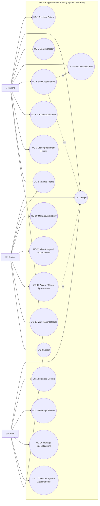
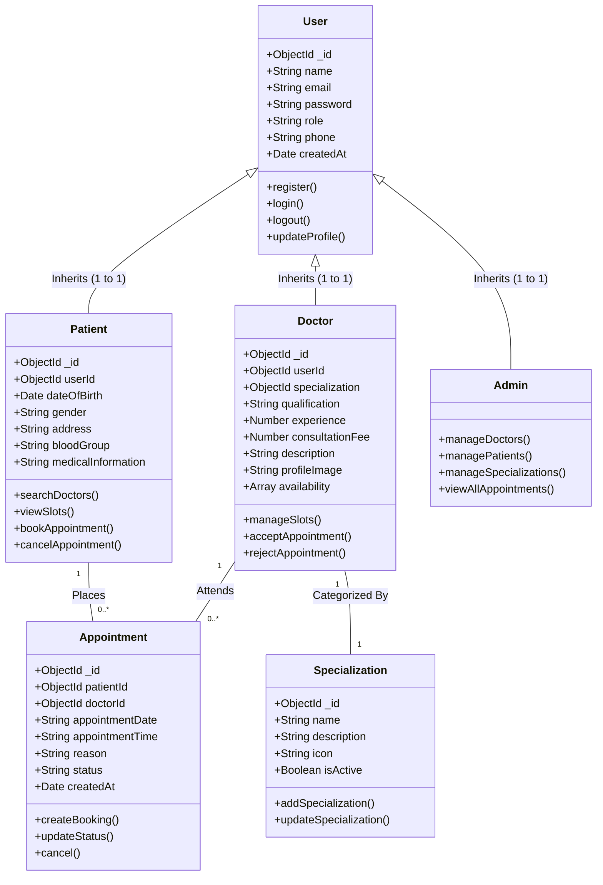
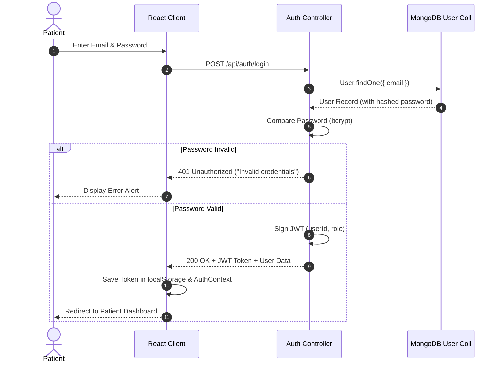
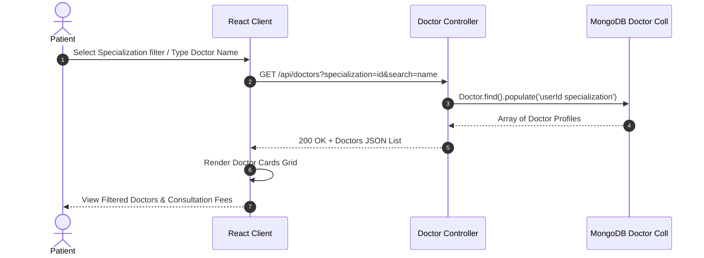
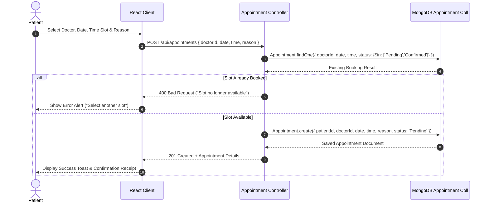
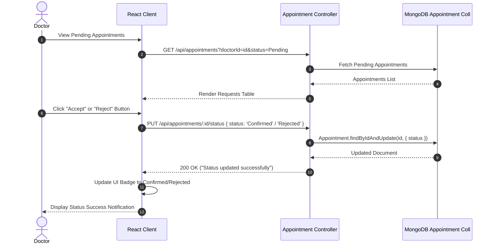
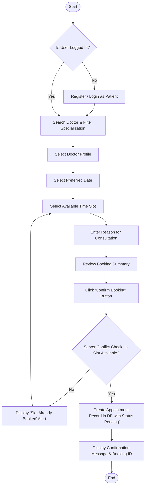
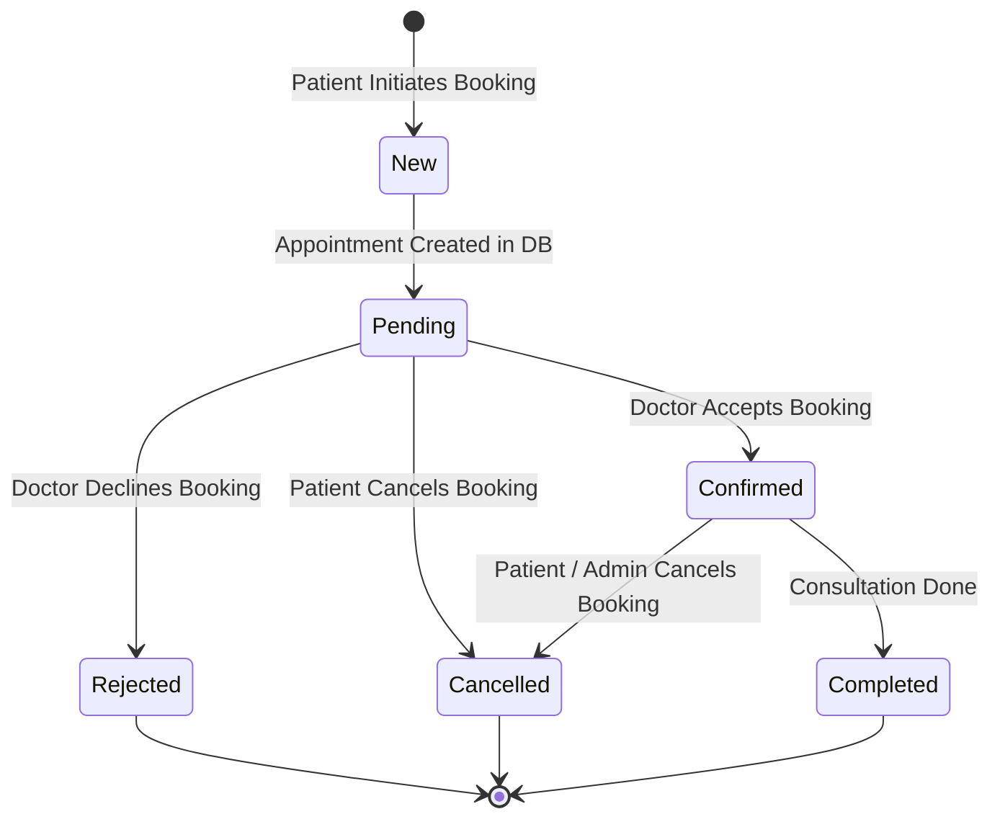
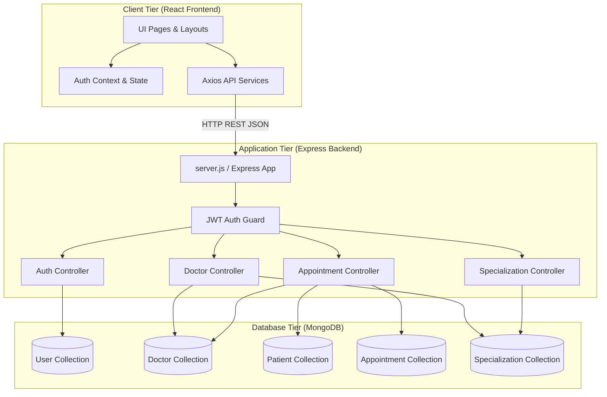
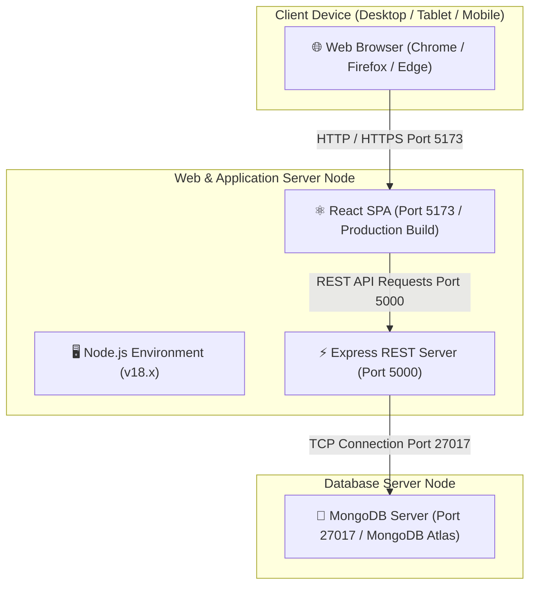

# Phase 3: Object-Oriented System Design & UML Diagrams
## Project Title: Medical Appointment Booking System
**Document Type:** Unified Modeling Language (UML) Specification Document (Argo UML Standard)  
**Target Audience:** Software Architects, Academic Evaluators, Viva Examiners  

---

## 1. Introduction & UML Standard

The **Unified Modeling Language (UML)** is standard visual modeling notation used to specify, visualize, construct, and document software artifacts. 

For the **Medical Appointment Booking System (MABS)**, 7 standard UML diagrams have been designed in accordance with standard Argo UML object-oriented modeling guidelines:

1. **Use Case Diagram** (Functional Boundaries & Actors)
2. **Class Diagram** (Static Object Structure)
3. **Sequence Diagrams** (Dynamic Interaction Specifications for 4 Key Scenarios)
4. **Activity Diagram** (Workflow Behavior & Decisions)
5. **State Chart Diagram** (Lifecycle State Machine for Appointments)
6. **Component Diagram** (Physical Software Module Organization)
7. **Deployment Diagram** (Node Topology & Hardware Deployment)

---

## 2. Diagram 1: Use Case Diagram

### 2.1 Actors
1. **Patient:** Primary user searching for doctors and booking appointments.
2. **Doctor:** Healthcare provider managing availability and approving requests.
3. **Admin:** System supervisor managing users, doctors, and specializations.

### 2.2 Use Case Diagram (Mermaid Rendering)

---

## 3. Diagram 2: Class Diagram

### 3.1 Class Structure & Relationships

---

## 4. Diagram 3: Sequence Diagrams

### Sequence A: Patient Login Workflow

---

### Sequence B: Doctor Search Workflow

---

### Sequence C: Appointment Booking Workflow (With Collision Prevention)

---

### Sequence D: Doctor Approval / Rejection Workflow

---

## 5. Diagram 4: Activity Diagram (Appointment Booking)

---

## 6. Diagram 5: State Chart Diagram (Appointment Lifecycle)

---

## 7. Diagram 6: Component Diagram

---

## 8. Diagram 7: Deployment Diagram

---

## 9. Viva Preparation Notes (Phase 3 Focus)

When presenting UML diagrams in viva:

1. **What is the difference between Use Case include and extend?**  
   *Answer:* `<<include>>` indicates mandatory execution (e.g., *Book Appointment* mandatory includes *View Available Slots*). `<<extend>>` indicates optional behavior that occurs under specific conditions (e.g., *Cancel Appointment* extends *View Appointment Details*).

2. **How does the Class Diagram handle inheritance?**  
   *Answer:* `User` is the parent superclass containing base credentials (`name`, `email`, `password`, `role`). `Patient`, `Doctor`, and `Admin` extend `User` via 1-to-1 generalization, adding role-specific attributes.

3. **Explain the State Chart Diagram transitions.**  
   *Answer:* An appointment begins in `New`, transitions to `Pending` upon database record creation, moves to `Confirmed` or `Rejected` based on doctor action, and reaches a terminal state of `Completed` or `Cancelled`.
